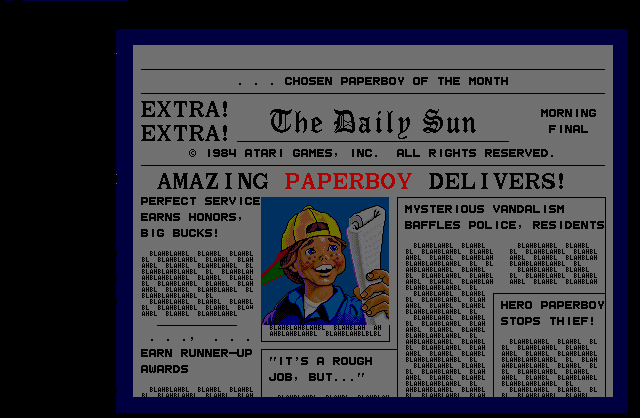

# Atari System-II Arcade

## About  
FPGA implementation of Atari System 2 arcade platform from 1985.  
Based on the SP-275, SP-290, SP-292, SP-294 SP-308 schematics  

System-2 supported game cartridges according to MAME  
* Accelerator (unreleased prototype)
* Gremlins (unreleased prototype)

* Paperboy (1985)
* Super Sprint (1986)
* Championship Sprint (1986)
* 720 degrees (1986)
* APB: All Points Bulletin (1987)

# WORK IN PROGRESS  
Very early stages, totally non functional  
* In simulation the T11 CPU can execute instructions  
* Audio non existent, needs to be coded  
* Video circuit missing contents of 512x4 PROM (82S131) used for video ROM address decoding, this is a showstopper for now until a PROM can be dumped by someone with physical access to a PCB  

Output of simulation of video circuit with RAMs preloaded with data dumped from MAME  
Only PlayField (PF) and AlphaNumerics (AN) data rendered, because MotionObjects (MO) requires the above mentioned PROM data.  
 
