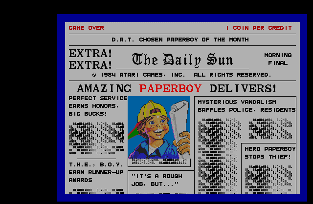
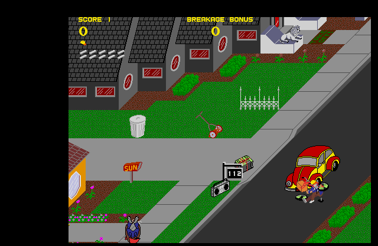
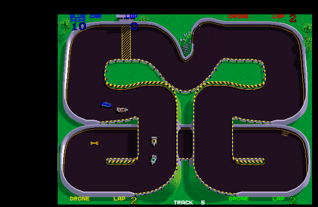
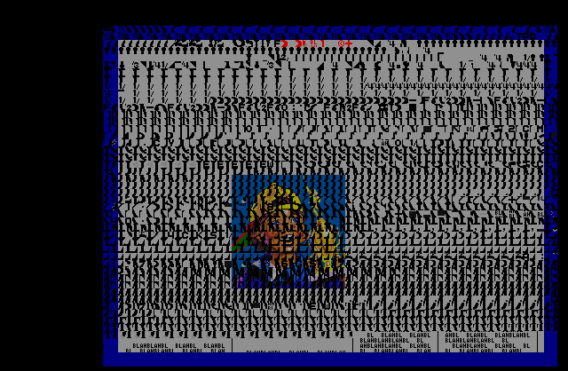

# Atari System-II Arcade

## About  
FPGA implementation of Atari System 2 arcade platform from 1985.  
Based on the SP-275, SP-290, SP-292, SP-294 SP-308 schematics  

System-2 supported game cartridges according to MAME  
* Accelerator (unreleased prototype)
* Gremlins (unreleased prototype)

* Paperboy (1985)
* Super Sprint (1986)
* Championship Sprint (1986)
* 720 degrees (1986)
* APB: All Points Bulletin (1987)

# WORK IN PROGRESS  
Early stages, totally non functional  
* In simulation the T11 CPU can execute instructions  
* Audio non existent, needs to be coded  
* Video section appears fully working in simulation when RAMs are preloaded with data dumped from MAME  
#### Paperboy Title screen  
  
#### Paperboy in game  
  
#### Championship Sprint in game  
  

#### T-11 core driving the video  
  

The T-11 CPU core is now hooked to the video circuit and running, simulation however doesn't produce the expected title screen. The T-11 is writing the correct data to the video processor RAM for the playfield as can be seen by the background being visible however the alphanumeric RAM is filled with incorrect data producing the artifacts seen on the screen. This isn't a simple case of the T-11 messing up the writes to the RAM, it really is writing incorrect values. Some debugging is required, I have a suspicion there may be a subtel bug i nthe T-11 core maybe as the code execution of the T-11 diverges after a while when compared with MAME (different CPU register values) which leads to incorrect values being calculated and written to the video RAM.  

This is just a hunch, it may well be that the T-11 is functioning correctly but it reaches unexpected results because of some other implementation issues, this is after all work in progress and there are still missing inputs to the CPU core and lots more debugging to be done.  

# Many thanks to
* Colin Davies (ColinD - UKVAC) for supporting the preservation of old arcades and dumping the contents of the 82S131 PROM from the Atari Championship Sprint arcade video board. This allowed the video circuit to properly display the Motion Objects (sprites).  
* Vslav (1801BM1) for the [T-11 core](https://github.com/1801BM1/cpu11/tree/master/t11) which made this project possible.  
